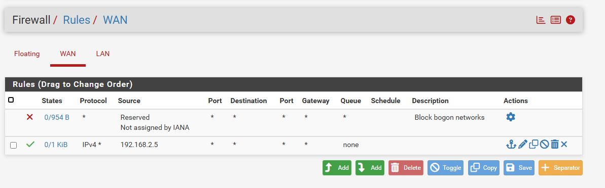

## 1. Project Overview

This is my implementation of a pfSense virtual firewall within a VirtualBox environment. It is designed to help understand how to deploy and manage firewalls, configure WAN and LAN networks, and work within a virtualised network environment. The setup consists of a Windows 10 host machine, a Kali Linux attacker, and a pfSense gateway. I integrated Suricata into the pfSense gateway to provide intrusion detection and logging, and conducted controlled vulnerability tests from the Kali machine to generate and analyse the resulting alerts.

---

## 2. Network Topology

---

## 3. Environment & Tools

- **pfSense CE:** 2.8.1-RELEASE  
- **VirtualBox:** 7.0.12  
- **Windows 10:** Version 22H2 (OS Build 19045.3803)  
- **Kali Linux:** Rolling 2025.3 (kali-rolling)

---

## 4. Setup Steps

1. **Configure VirtualBox VMs (CPU/RAM/NICs)**  
     
   - **NatNetwork** assigned to Windows 10 (LAN)  
   - **NatNetwork1** assigned to Kali Linux (WAN)

2. **Install pfSense and assign WAN/LAN interfaces**  
   

3. **Configure firewall rules (with an exception allowing all traffic from Kali Linux for testing)**  
   

4. **Connect Windows 10 and Kali Linux to pfSense**  
   - Windows 10 IP address statically set to `10.0.2.120` (pfSense gateway: `10.0.2.100`)  
       
   - Kali Linux obtains its IP address automatically via DHCP (`192.168.2.5`)  
     

5. **Install and Configure Suricata on pfSense**  
   - Add Suricata through pfSense Package Manager  
   - Enable Suricata on the WAN interface  
       
   - Select and update rulesets (Emerging Threats)  
   - Verify alerts appear under **Services → Suricata → Alerts**

---

## 5. Security Features Implemented

- **Stateful Firewall (pfSense)**
  - Default-deny policy on WAN; no inbound port forwards
  - NAT configured for LAN → WAN traffic

- **Intrusion Detection (Suricata – alert mode)**
  - Integrated on the pfSense gateway to log/alert suspicious traffic
  - Standard rulesets enabled; alerts reviewed in the pfSense UI
  - Verified with controlled vulnerability tests from the Kali VM

- **Network Segmentation**
  - Two zones: **WAN** `192.168.2.0/24`, **LAN** `10.0.2.0/24`

- **Testing Exception**
  - Temporary rule created to allow unrestricted traffic from the Kali Linux VM for alert generation  
    

---

## 6. Testing & Validation

- **Connectivity Tests:** Verified LAN ↔ WAN connectivity using ping  
- **Port Scans:** Performed Nmap scans from Kali against the Windows host to test firewall rules  
- **IDS Alerts:** Launched simulated vulnerability attacks from Kali; Suricata generated alerts as expected  
    
- Suricata logged 164 attacks (classification types and counts shown below)  
  

---

## 7. Lessons Learned

### Challenges & Solutions

- **LAN/WAN Configuration:** Initially struggled with configuring the correct VirtualBox network types and IP addressing for the WAN and LAN interfaces. I solved it by documenting the adapter types and mapping them carefully to pfSense interfaces.
- **pfSense IP Addressing:** Encountered issues assigning the correct WAN IP address to the pfSense interface and resolved them by adjusting the pfSense network adapter settings.
- **Windows Firewall Interference:** Disabled the built-in Windows Firewall to ensure traffic flowed as expected during testing.
- **Suricata Rules:** Experimented with different Suricata rulesets to generate useful alerts without overwhelming logs.

### Future Improvements

- **Deeper Firewall Rule Management:** Further explore rule creation, scheduling, and other advanced features in pfSense to implement more sophisticated configurations and replicate a more realistic environment.
- **IPS Mode Testing:** Move Suricata from alert-only to IPS mode to see how active blocking affects traffic.
- **Centralised Log Analysis:** Integrate a SIEM such as Splunk or Elastic to ingest pfSense and Suricata logs, gaining hands-on experience with widely used security tools.
- **Active Directory Integration:** Add a small AD environment to practice identity-aware rules and simulate more realistic enterprise scenarios.
